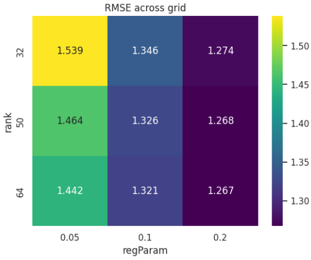
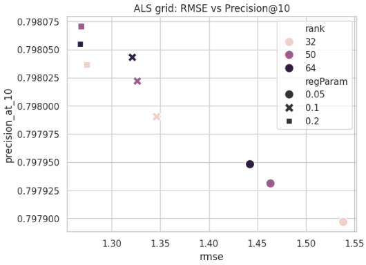
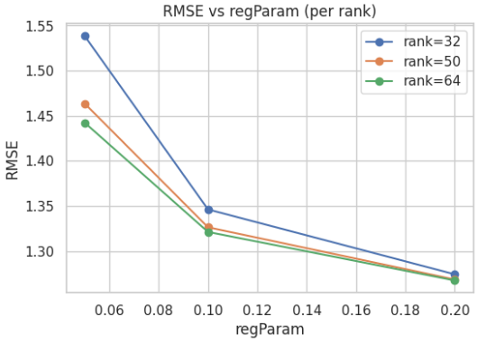
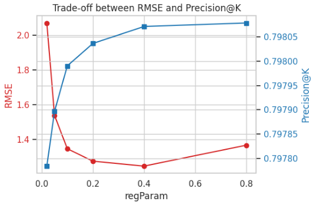

# Amazon Product Recommender System

An end-to-end recommender system built on the Amazon Product Reviews dataset (Electronics subset).

## Architecture Overview

<p align="center">
  <br/>
</p>

## Dataset

This project uses the Amazon Product Reviews — Electronics subset (5-core) from Stanford SNAP. The 5-core variant includes only users and items with at least 5 interactions, making it suitable for collaborative filtering.

- Source (JSON lines): one review per line; gzipped file supported
- Key fields we use:
  - `reviewerID` → `user_id`
  - `asin` → `item_id`
  - `overall` (1–5) → `rating`
  - `unixReviewTime` (optional) → timestamp

During ETL, these are cleaned, filtered (≥ MIN_INTERACTIONS), and remapped to dense indices (`user_idx`, `item_idx`) for efficient modeling. The dataset is auto-downloaded to `RAW_REVIEWS_PATH` if missing using `RAW_REVIEWS_URL`.

## Repository Layout

```
amazon-recommender/
├── data/
│   ├── raw/
│   ├── processed/
│   └── README.md
├── src/
│   ├── etl/
│   ├── models/
│   ├── serving/
│   ├── utils/
│   │   ├── config.py
│   │   └── logging.py
│   └── pipeline.py
├── notebooks/
│   └── README.md
├── docker-compose.yml
├── Dockerfile
├── requirements.txt
├── Makefile
└── README.md
```

## Getting Started

### Prerequisites
- Docker and Docker Compose
- (Optional) Python 3.10+ if running locally without Docker

### Quickstart (Docker)
```bash
docker compose build
docker compose up -d
# Exec into container if needed
docker exec -it amazon-recommender-app bash
```

### Local (No Docker)
```bash
python -m venv .venv
source .venv/bin/activate
pip install -r requirements.txt
```

Note: `requirements.txt` is configured with the CPU-only PyTorch wheel; no CUDA/GPU is required.

## Pipeline CLI

```bash
python src/pipeline.py --help
python src/pipeline.py etl [--input PATH] [--min-interactions N]
python src/pipeline.py train
python src/pipeline.py train_als [--rank 50 --reg 0.1 --alpha 1.0 --maxiter 10 --sample-fraction 0.2 --sample-seed 42]
python src/pipeline.py eval
python src/pipeline.py deploy
```

The `etl` command is implemented; other commands may still be placeholders.

### Model Training — ALS

Run:
```bash
python src/pipeline.py train_als --rank 50 --reg 0.1 --alpha 1.0 --maxiter 10 --sample-fraction 0.01
```

Tip: Use `--sample-fraction <0-1]` to train quickly on a subset during development.

Outputs:
- `artifacts/als_model/` (Spark ALS model)
- `artifacts/als_model/metadata.json` (params + metrics)
- `artifacts/metrics/mlflow_run_id.txt` (if MLflow logging succeeds)

#### MLflow UI

Launch the UI locally to inspect runs (best + all grid candidates):

```bash
mlflow ui --host 0.0.0.0 --port 5000 --backend-store-uri ./mlruns
# then open http://localhost:5000
```

Notes:
- Tracking URI defaults to `file:./mlruns` unless overridden via `MLFLOW_TRACKING_URI`.
- Experiment name: `ALS_Recommender`.
- Each grid candidate is a nested run; the best run is tagged `best=true` and logs artifacts.

### ETL

Inputs (CSV/TSV/JSON/JSON.GZ): must contain fields equivalent to `user_id`, `item_id`, `rating`.

Run with Docker:
```bash
docker exec -it amazon-recommender-app \
  python src/pipeline.py etl \
  --input data/raw/reviews_electronics.json.gz \
  --min-interactions 5
```

Run locally (no Docker):
```bash
python src/pipeline.py etl --input data/raw/reviews_electronics.json.gz --min-interactions 5
```

Outputs are written to `data/processed/`:
- `interactions.parquet` — columns: `user_idx`, `item_idx`, `rating`
- `user_map.parquet` — columns: `user_idx`, `user_id`
- `item_map.parquet` — columns: `item_idx`, `item_id`
- `popular_items.parquet` — columns: `item_idx` or `item_id`, `count_ratings`, `avg_rating`

Example log on success:
```
✅ Processed X rows → Y users × Z items
Saved popularity table to: data/processed/popular_items.parquet
```

If the input file does not exist, the ETL will automatically download it from `RAW_REVIEWS_URL` into `RAW_REVIEWS_PATH`.

### EDA (Notebooks & Utilities)

- Example notebook: `notebooks/01_data_overview.ipynb`
- Importable utilities under `src/eda/`:

```python
from src.eda.overview import basic_stats, rating_summary
from src.eda.activity import plot_user_activity, plot_item_popularity
from src.eda.ratings import plot_distribution
```

Note: Plotting uses matplotlib/seaborn; functions sample data to keep visuals responsive.

## Pipeline steps

- Data ingestion
  - Downloads the Electronics reviews file automatically if missing using `RAW_REVIEWS_URL` → `RAW_REVIEWS_PATH`.
  - Supports CSV/TSV/JSON/JSON.GZ input formats.

- ETL & feature engineering (Spark)
  - Cleans rows with null `user_id`, `item_id`, `rating` and filters users/items with at least `MIN_INTERACTIONS` interactions.
  - Remaps string IDs to dense integer indices via `StringIndexer` for efficient modeling:
    - `user_id` → `user_idx`, `item_id` → `item_idx` (stable label order).
  - Writes processed outputs under `data/processed/`: `interactions.parquet`, `user_map.parquet`, `item_map.parquet`.
  - Computes `popular_items.parquet` (global counts and average ratings) for cold-start fallback.

- Model training (ALS, Spark MLlib)
  - Trains explicit-feedback ALS on `(user_idx, item_idx, rating)` with an 80/20 train/validation split.
  - Performs a small grid search (configurable via CLI): `rank ∈ {32, 50, 64}`, `regParam ∈ {0.05, 0.1, 0.2}`.
  - Selects the best model by highest Precision@10 (tie-break by lowest RMSE); reports NDCG@10.
  - Saves artifacts to `artifacts/als_model/` with `metadata.json`; attempts MLflow logging when available.

- Evaluation
  - Offline metrics: RMSE, Precision@K, NDCG@K used to select/compare models.

- Serving (upcoming)
  - FastAPI-based API to serve recommendations; integrates with saved ALS artifacts and cold-start logic.

- EDA utilities
  - Importable helpers in `src/eda/` and example notebook `notebooks/01_data_overview.ipynb` for quick stats and plots.

## Configuration & Logging
- Environment variables can be set in a `.env` at repo root.
- An example file is provided: `.env.example` (copy to `.env`).
- `src/utils/config.py` loads configuration and common paths.
- `src/utils/logging.py` sets up a project-wide Loguru logger.

Key variables (with defaults):
- `RAW_REVIEWS_PATH`: `data/raw/reviews_electronics.json.gz`
- `RAW_REVIEWS_URL`: `https://snap.stanford.edu/data/amazon/productGraph/categoryFiles/reviews_Electronics_5.json.gz`
- `MIN_INTERACTIONS`: `5`
- `LOG_LEVEL`: `INFO`
- `ENVIRONMENT`: `local`
- `MLFLOW_TRACKING_URI`: `file:./mlruns`

## Roadmap
1. Model Training: ALS (Spark) and NCF (PyTorch)
2. Evaluation & MLflow tracking
3. Serving API with FastAPI + Docker
4. Optional Streamlit/Gradio demo and cold-start strategies

## Results

Two rounds of experiments were conducted to analyze how the Alternating Least Squares (ALS) model behaves under different hyperparameter settings on the Amazon Electronics dataset. Each experiment measured RMSE, Precision@10, and NDCG@10 on a held-out validation split.

### Round 1 — Rank × Regularization Grid Search

The first experiment explored a small 3×3 grid over latent factor dimension (`rank`) and regularization strength (`regParam`), optimizing primarily for RMSE and secondarily for Precision@10.

| rank | regParam | RMSE ↓   | Precision@10 ↑ | NDCG@10 ↑  |
| ---- | -------- | -------- | -------------- | ---------- |
| 32   | 0.05     | 1.54     | 0.7979         | 0.8593     |
| 32   | 0.10     | 1.35     | 0.7980         | 0.8625     |
| 32   | 0.20     | 1.27     | 0.7980         | 0.8644     |
| 50   | 0.05     | 1.46     | 0.7979         | 0.8602     |
| 50   | 0.10     | 1.33     | 0.7980         | 0.8633     |
| 50   | 0.20     | 1.27     | 0.7981         | 0.8649     |
| 64   | 0.05     | 1.44     | 0.7979         | 0.8604     |
| 64   | 0.10     | 1.32     | 0.7980         | 0.8635     |
| 64   | 0.20     | **1.27** | **0.7981**     | **0.8652** |

**Findings**

* RMSE improved steadily as `regParam` increased from 0.05 → 0.20, suggesting that stronger regularization reduces overfitting.
* Ranking metrics (Precision@10, NDCG@10) remained almost constant (~0.798 / 0.865), indicating model robustness to `rank` and regularization changes.
* Increasing `rank` (from 32 → 64) provided minimal gain, implying diminishing returns in latent dimensionality for this dataset.

Since `rank` had negligible impact while `regParam` showed clear trends, I fixed `rank = 32` and ran a focused sweep over regularization strength in the next round.

<p align="center">
  
</p>

<p align="center">
  
</p>

<p align="center">
  
</p>


### Round 2 — Regularization Sweep (Precision@K–first selection)

The second experiment fixed `rank = 32` and varied `regParam` ∈ {0.02, 0.05, 0.1, 0.2, 0.4, 0.8}, this time prioritizing Precision@10 as the main optimization target (tie-breaking on RMSE).

| regParam | RMSE ↓   | Precision@10 ↑ | NDCG@10 ↑  |
| -------- | -------- | -------------- | ---------- |
| 0.02     | 2.07     | 0.7978         | 0.8562     |
| 0.05     | 1.54     | 0.7979         | 0.8593     |
| 0.10     | 1.35     | 0.7980         | 0.8625     |
| 0.20     | 1.27     | 0.7980         | 0.8644     |
| 0.40     | **1.25** | 0.7981         | 0.8660     |
| 0.80     | 1.37     | **0.7981**     | **0.8662** |

**Findings**

* RMSE decreased sharply up to `regParam ≈ 0.4`, then rose slightly at `0.8`, confirming the expected bias–variance trade-off.
* Ranking metrics remained stable across all values, suggesting the model’s top-K performance is largely insensitive to small changes in regularization.
* The best configuration by Precision@10 was `regParam = 0.8` (RMSE = 1.37, Precision@10 = 0.7981, NDCG@10 = 0.8662), though 0.2–0.4 offered nearly identical performance with lower bias.

<p align="center">
  <br/>
  <em>Round 2: Effect of regularization on RMSE and ranking metrics (rank fixed at 32).</em>
</p>


### Interpretation

The ALS recommender achieves consistent ranking performance across a wide range of configurations, with RMSE improving as regularization increases up to moderate levels.
For practical purposes, **`rank = 32` and `regParam ≈ 0.2–0.4`** provide an excellent balance between generalization and computational cost.
These results establish a solid baseline to compare future models, such as neural collaborative filtering, within the same experimental framework.


## License
This project is for educational and portfolio demonstration purposes.
